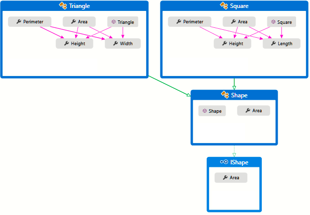
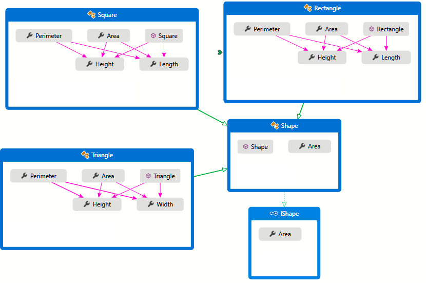
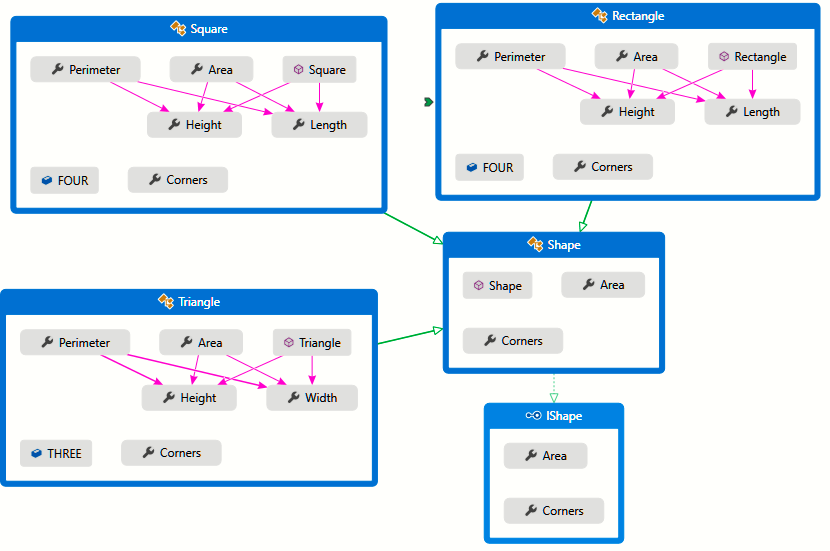
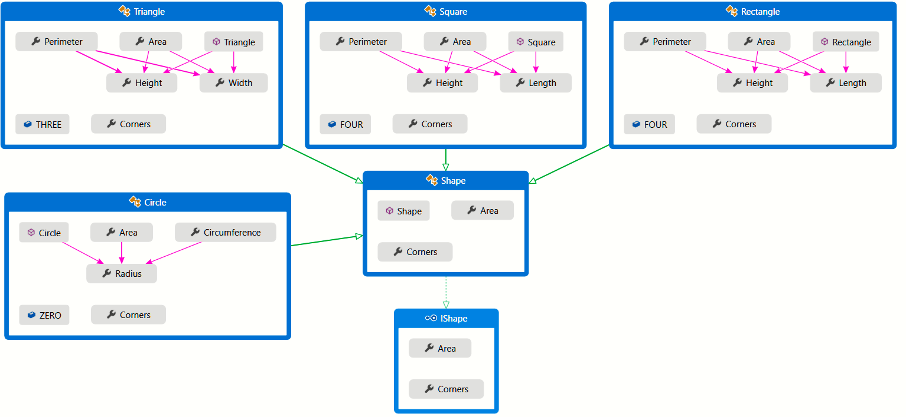
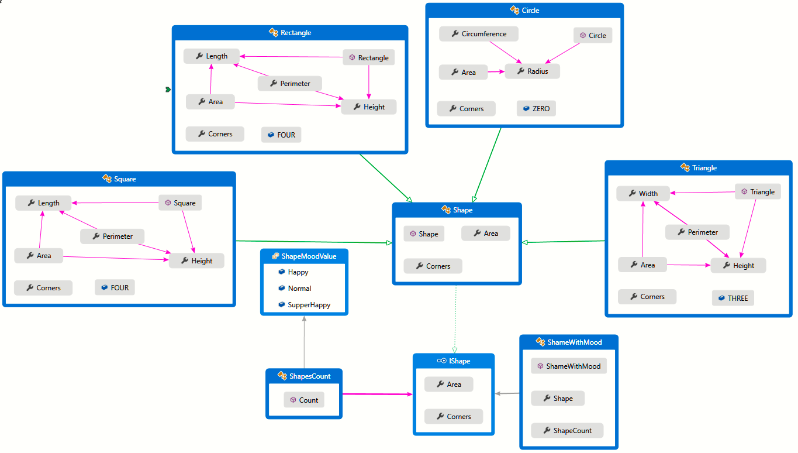

# Answers

## ONE

To define the shapes create a ***IShape*** interface:

```c#
public interface IShape
{
    double Area { get; }   
}
```

This will be the root contract to all solutions, next we create the abstract class ***Shape*** with inheritance of ***IShape***

```c#
public abstract class Shape : IShape
{
    abstract public double Area { get; }
}
```

I create class **Triangle** and **Square**, implementing Shape and inheritance of it.

```c#
public class Triangle : Shape
{
    public double Perimeter { get => Height + Width + (Math.Sqrt(Math.Pow(Height, 2) + Math.Pow(Width, 2))); }
    public override double Area { get => 0.5 * Height * Width; }
    private double Width { get; set; }
    private double Height { get; set; }

    public Triangle(double width, double height)
    {
        Width = width;
        Height = height;
    }
}
```

```c#
public class Square : Shape
{

    public double Perimeter { get => 2 * (Length + Height); }
    public override double Area { get => Length * Height; }
    private double Length { get; set; }
    private double Height { get; set; }

    public Square(double length, double height)
    {
        Height = height;
        Length = length;
    }

}
```

The solutions might like something like this:

 

## TWO

I create the **Rectangle** class, implementing **Shape** and inheritance of it.

 ```c#
 public class Rectangle : Shape
 {
     public double Perimeter { get => 2 * (Length + Height); }
 
     public override double Area { get => Length * Height; }
 
     private double Length { get; set; }
     private double Height { get; set; }
   
     public Rectangle(double length, double height)
     {
         Height = height;
         Length = length;
     }
 }
 ```

Adding the above class, the solutions might like something like this:



### THREE

Adding a Conner functionality at our project, starting with ***IShape*** interface and implementing in ***Shape*** abstract class.

```c#
public interface IShape
{
    double Area { get; }
    ushort Corners { get; }
}
```

```c#
public abstract class Shape : IShape
{
	abstract public double Area { get; }

	abstract public ushort Corners {get;}
}
```

Adding the implementations in **Triangle**, **Square** and **Rectangle** class:

```c#
public class Triangle : Shape
{
    public double Perimeter { get => Height + Width + (Math.Sqrt(Math.Pow(Height, 2) + Math.Pow(Width, 2))); }
    public override double Area { get => 0.5 * Height * Width; }
    private double Width { get; set; }
    private double Height { get; set; }
    const ushort THREE = 3;
    public override ushort Corners => THREE;

    public Triangle(double width, double height)
    {
        Width = width;
        Height = height;
    }
}
```

```c#
public class Square : Shape
{
    public double Perimeter { get => 2 * (Length + Height); }
    public override double Area { get => Length * Height; }
    private double Length { get; set; }
    private double Height { get; set; }
    const ushort FOUR = 4;
    public override ushort Corners => FOUR;

    public Square(double length, double height)
    {
        Height = height;
        Length = length;
    }
}
```

```c#
public class Rectangle : Shape
{
    public double Perimeter { get => 2 * (Length + Height); }

    public override double Area { get => Length * Height; }

    private double Length { get; set; }
    private double Height { get; set; }
    const ushort FOUR = 4;
    public override ushort Corners => FOUR;

    public Rectangle(double length, double height)
    {
        Height = height;
        Length = length;
    }
}
```

Adding the functionality of the above classes, the solution might see something like this:



Now create the Test Method to testing the functionality and use this instantiate of classes triangle, square and rectangle, the solution  might see something like this:

Testing Areas and Corners

```c#
private const double areaExpected = 60.5;
private const uint cornerExpected = 15;
private const int countsExpected = 1196;

[TestMethod()]
public void AreaSumTest()
{
    IShape squareOne = new Square(5, 4);
    IShape squareTwo = new Square(3, 4);
    IShape triangleOne = new Triangle(5, 9);
    IShape rectangleOne = new Rectangle(3,2);
    
    List<IShape> listOfShapes = new() { squareOne, squareTwo, triangleOne , rectangleOne };

    var sumations = listOfShapes.Sum(shapes => shapes.Area);

    Assert.AreEqual(areaExpected, sumations);
}
[TestMethod]
public void CornersSumTest()
{
    IShape squareOne = new Square(5, 4);
    IShape squareTwo = new Square(3, 4);
    IShape triangleOne = new Triangle(5, 9);
    IShape rectangleOne = new Rectangle(3,2);

    List<IShape> listOfShapes = new() { squareOne, squareTwo, triangleOne, rectanbleOne };

    var sumOfCorners = listOfShapes.Sum(shapes => shapes.Corners);

    Assert.AreEqual(cornerExpected, (uint) sumOfCorners);
}
```

### FOUR

Adding the Circle class with corner zero.

```c#
public class Circle : Shape
{
    public double Circumference { get => 2 * 3.14159 * Radius; }
    public override double Area { get => 3.14159 * (Radius * Radius); }
    private double Radius { get; set; }
    const ushort ZERO = 0;
    public override ushort Corners => ZERO;

    public Circle(double radius)
    {
        Radius = radius;
    }
}
```

Adding the functionality of the above classes, the solution might see something like this:



### FIVE

To implement The Shape mood I add this public enum **ShapeModValue**:

```c#
public enum ShapeMoodValue
{
    Normal = 0,
    Happy,
    SupperHappy
}
```

The challenge to add the new requirements without change the classes of Shapes, I solve using methods of extensions:

```c#
public static class ShapesCount
{
    public static double Count(this IShape shape, ShapeMoodValue mood)
    {
        const int TRIPLE = 3;
        const int DOUBLE = 2;
        const ushort TEN_CORNERS = 10;
        const ushort FIVE_CORNERS = 5;
        double count = default;
        switch (mood)
        {
            case ShapeMoodValue.Normal:
                count = shape.Area + shape.Corners;
                break;
            case ShapeMoodValue.Happy:
                count = shape.Area * DOUBLE + shape.Corners * DOUBLE;
                break;
            case ShapeMoodValue.SupperHappy:
                count = shape.Area * TRIPLE + shape.Corners * TRIPLE;
                break;
        }
        return count;
    }
}
```

The next step is add the intermediate class to implement the operations in the shapes adding the count of mood:

```c#
public class ShameWithMood 
{
    public IShape Shape { get; set; }

    public int ShapeCount { get; set; }

}
```

I Define the test method to test the functionality:

```c#
private const int countsExpected = 173;

[TestMethod]
public void MoodTest()
{
    ShameWithMood squareOne = new() {
        Shape = new Square(5, 4), 
        ShapeCount = (int) new Square(5,4).Count(ShapeMoodValue.Happy)};
    ShameWithMood squareTwo = new() { 
        Shape = new Square(3, 4), 
        ShapeCount = (int)new Square(5, 4).Count(ShapeMoodValue.SupperHappy) };
    ShameWithMood triangleOne = new() { 
        Shape = new Triangle(5, 9), 
        ShapeCount = (int)new Triangle(5, 4).Count(ShapeMoodValue.SupperHappy) };
    ShameWithMood rectangleOne = new() { 
        Shape = new Rectangle(4, 2), 
        ShapeCount = (int)new Triangle(4, 2).Count(ShapeMoodValue.Happy) };

    List<ShameWithMood> listOfShapes = new() { squareOne, squareTwo, triangleOne, rectangleOne }; 

    var sumOfCounts = listOfShapes.Sum(lists => lists.ShapeCount);

    Assert.AreEqual(countsExpected, sumOfCounts);
}
```

The above added classes are shown below in the class diagram which might look something like this:



### SIX

I modify the class ShapesCount to add the circle mood funcionality.

```c#
public static class ShapesCount
{
    public static double Count(this IShape shape, ShapeMoodValue mood)
    {
        const int TRIPLE = 3;
        const int DOUBLE = 2;
        const ushort TEN_CORNERS = 10;
        const ushort FIVE_CORNERS = 5;
        double count = default;
        switch (mood)
        {
            case ShapeMoodValue.Normal:
                count = shape.Area + shape.Corners;
                break;
            case ShapeMoodValue.Happy:
                if (shape.GetType() == typeof(Circle))
                    count = shape.Area * DOUBLE + FIVE_CORNERS * DOUBLE;
                else
                    count = shape.Area * DOUBLE + shape.Corners * DOUBLE;
                break;
            case ShapeMoodValue.SupperHappy:
                if (shape.GetType() == typeof(Circle))
                    count = shape.Area * TRIPLE + TEN_CORNERS * TRIPLE;
                else
                    count = shape.Area * TRIPLE + shape.Corners * TRIPLE;
                break;
        }
        return count;
    }
}
```

```c#
private const int countsExpected = 1210;
[TestMethod]
public void MoodTest()
{
    ShameWithMood squareOne = new() { 
                  Shape = new Square(5, 4), 
                  ShapeCount = (int)new Square(5, 4).Count(ShapeMoodValue.Happy) };
    ShameWithMood squareTwo = new() { 
                  Shape = new Square(3, 4), 
                  ShapeCount = (int)new Square(5, 4).Count(ShapeMoodValue.SupperHappy) };
    ShameWithMood triangleOne = new() { 
                  Shape = new Triangle(5, 9), 
                  ShapeCount = (int)new Triangle(5, 4).Count(ShapeMoodValue.SupperHappy) };
    ShameWithMood rectangleOne = new() { 
                  Shape = new Rectangle(4, 2), 
                  ShapeCount = (int)new Triangle(4, 2).Count(ShapeMoodValue.Happy) };
    ShameWithMood circle = new() { 
                  Shape = new Circle(3), 
                  ShapeCount = (int)new Circle(3).Count(ShapeMoodValue.Normal) };
    ShameWithMood circleHappy = new() { 
                  Shape = new Circle(9), 
                  ShapeCount = (int)new Circle(9).Count(ShapeMoodValue.Happy) };
    ShameWithMood circleSupperHappy = new() { 
                  Shape = new Circle(7), 
                  ShapeCount = (int)new Circle(7).Count(ShapeMoodValue.SupperHappy) };
    List<ShameWithMood> listOfShapes = new()
    {
        squareOne,
        squareTwo,
        triangleOne,
        rectangleOne,
        circle,
        circleHappy,
        circleSupperHappy,
    };
    var sumOfCounts = listOfShapes.Sum(lists => lists.ShapeCount);
    Assert.AreEqual(countsExpected, sumOfCounts);
}
```


