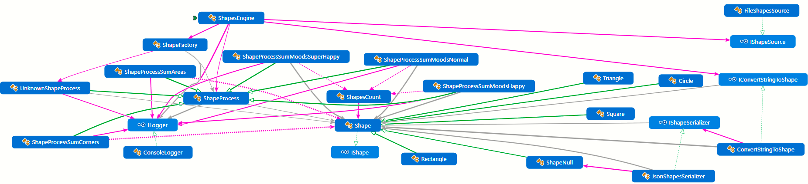

# Aplicando SOLID al proyecto de Shapes

Aplicando Single Responsibility Principle y Open Close Principle, Interface Segregation Principle and Dependency Inversion Principle.

## Aplicando SOLID

Contar Areas

Contar Esquinas

Contar EstadosDeAnimoDelasFormas 

Motor de las formas (ShapeEngine)
Tendrá:
Un Logger
Un creador de la lista de formas
Recuperador del fichero en disco (json) con la lista de formas a crear
Deserializar la jerarquia de clases (JSON con deserialización de polimorfismos)
Una Factoria, para que podamos pasar la lista de formas y realizar las operaciones

El motor de las formas debe tener una colección o lista de formas

El motor de formas debe llamar a la factoría para
 1 - Contar Areas
 2 - Contar Esquinas
 3 - Contar los estados de animo

El último proceso será la excepción a la regla de la factoría, una vez que en este escenario esta realizado después de que todo y no se quiere alterar las figuras (shapes), si no extenderlas.

Lo he resuelto con la clase Operacion de estados de animo de formas:
ShapeProcessSumMoods:

```c#
public class ShapeProcessSumMoods : ShapeProcess
{
    public ShapeProcessSumMoods(ShapesEngine engine, ConsoleLogger logger, ShapeMoodValue mood) : base
    (engine, logger)
    {
        Mood = mood;
    }
    public ShapeMoodValue Mood { get; }

    public override void Operate()
    {
        _logger.Looger("Process sum moods of shapes");
        if (_engine.ListShapes.Shapes == null)
        {
            _logger.Looger("Lista de Shapes en blanco");
            _engine.ResultOperation = 0;
        }
        double sumations = 0;
        if (_engine.ListShapes.Shapes.Count > 0)
        {
	    var sum = shapes.Sum(shapeS => shapeS.Count(Mood));
            _engine.ResultOperation = sum;
        }
    }
}
```
Como podemos ver se ha extendido el constructor para que acepte el estado de animo de las formas
y por otro lado la sumatoria es el resultdo de llamar a la construcción LINQ con Sum(shapeS => shapeS.Count(Mood)
Esto logra extender el proyecto para que acepte esta funcionalidad sin tocar nada de lo anterirmente realizado.

En la clase de factoria de formas se ha modificado el método así:
```c#
public class ShapeFactory
{
    public ShapeProcess CreateOperations(ShapeOperations operation, ShapesEngine engine)
    {
        switch (operation)
        {
            case ShapeOperations.SumAreas:
                return new ShapeProcessSumAreas(engine, engine.Logger); 
            case ShapeOperations.SumCorners:
                return new ShapeProcessSumCorners(engine, engine.Logger);
            case ShapeOperations.SumMoods:
                var shapeOperation = new ShapeProcessSumMoods(engine, engine.Logger,ShapeMoodValue.Happy);
                return shapeOperation;
        }
        return null;
    }
}
```
Se pasa lo que a los otros métodos añadiendo el estado de animo a proponer a las formas.

## LSP con el patron de objeto null

Hemos intentando no violar el LSP, siguiendo las recomendaciones de DIGA en cambio de PREGUNTE, aunque el cambio del processo de sumas según el estado de animo de formas ha impactado en nuestro código. Hemos incluido el siguiente codigo para continuar aplicando SOLID a nuestro proyecto:

```c#
public class ShapeFactory
{
    public ShapeProcess CreateOperations(ShapeOperations operation, ShapesEngine engine)
    {
        try
        {
            string typeName = $"ShapeProcess{operation}";
            if (!typeName.Contains("Moods"))
                return (ShapeProcess)Activator.CreateInstance(
                    Type.GetType(typeName),
                    new object[] { engine, engine.Logger });
            else
                return new ShapeProcessSumMoods(engine, engine.Logger, ShapeMoodValue.Happy);
        }
        catch
        {
            return new UnknownShapeProcess(engine, engine.Logger);
        }
    }
}
```
La clase ShapeEngine, ahora llamará al metodo CreateOperations de la clase fabrica de formas sin importar que devuelva un null o no.
```c#
public partial class ShapesEngine
{
    public ShapesEngine() {}
    public ConsoleLogger Logger { get; set; } = new ConsoleLogger();

    public ListShapesGetter ListShapes { get; set; } = new ListShapesGetter();
    public double ResultOperation { get; set; }

    public void Start(ShapeOperations operation)
    {
        Logger.Looger("Inicio de operaciones con las formas geométricas");
        Logger.Looger("Cargar las figuras a una lista");

        var listShapes = ListShapes?.GetListOfShapes(); 

        var shapeFactory = new ShapeFactory();

        var ResultShapesOperations = shapeFactory.CreateOperations(operation, this);
        ResultShapesOperations.Operate();

        Logger.Looger($"El resultado de {operation} es {ResultOperation}");
        Logger.Looger("Operacion completada");
    }
}
```

TODO (Descripción y detalle de lo añadido, resumen del GIT)

Implementación de las interfaces (Para cumplir con ISP)

Implementación de la Inyección de dependencias (Para cumplir con DIP) 

ISP: 

Añadimos ILogger, IShape, IShapeConfigBuilder, IShapeSerializer y IShapeSource


DIP:

Quitamos en ShapeEngine las dependicas de Logger, ListShapeGetter y ShapeFactory.

Los incluimos en el constructor para poder pasar Cualquier Logger, ListShapeGetter y ShapeFactory, (Ya no dependemos de ellos al menos no de manera fija), Al tener esta inversión de la dependencia, podremos cambiar dependencias que puedan cambiar el comportamiento de forma dinámica, muy apropiado para las pruebas.

## Pruebas unitarias (TDD)

Se han realizdo las pruebas unitarias, de infraestructura, core con todas las funcionalides probadas y con inyeccion de dependencias como apoyo definitivo a las prueba.

Tambien destacar los Fakes para comprobar a menor nivel de relación.

| Place           | Functionality   | Element                                 | UnitTest                                                     |
| --------------- | --------------- | --------------------------------------- | ------------------------------------------------------------ |
| Core            | Interfaces      | IConvertStringToShape.cs                | N/A                                                          |
| Core            | Interfaces      | ILogger.cs                              | N/A                                                          |
| Core            | Interfaces      | IShape.cs                               | N/A                                                          |
| Core            | Interfaces      | IShapeConfig.cs                         | N/A                                                          |
| Core            | Interfaces      | IShapeConfigBuilder.cs                  | N/A                                                          |
| Core            | Interfaces      | IShapeSerializer.cs                     | N/A                                                          |
| Core            | Interfaces      | IShapeSource.cs                         | N/A                                                          |
| Core            | Model           | Circle.cs                               | Tested in  serialization/deserialization                     |
| Core            | Model           | Rectangle.cs                            | Tested in  serialization/deserialization                     |
| Core            | Model           | Shape.cs                                | N/A                                                          |
| Core            | Model           | ShapeMoodValue.cs                       | N/A                                                          |
| Core            | Model           | ShapeNull.cs                            | N/A                                                          |
| Core            | Model           | ShapesCount.cs                          | N/A                                                          |
| Core            | Model           | Square.cs                               | Tested in  serialization/deserialization                     |
| Core            | Model           | Triangle.cs                             | Tested in  serialization/deserialization                     |
| Core            | ShapeProcess    | ShapeEnumsProcess.cs                    | N/A                                                          |
| Core            | ShapeProcess    | ShapeFactory.cs                         | ShapeFactoryTest.cs                                          |
| Core            | ShapeProcess    | ShapeProcess.cs                         | N/A                                                          |
| Core            | ShapeProcess    | ShapeProcessSumAreas.cs                 | ShapeProcessSumAreasTest.cs                                  |
| Core            | ShapeProcess    | ShapeProcessSumCorners.cs               | ShapeProcessSumCornersTest.cs                                |
| Core            | ShapeProcess    | ShapeProcessSumMoodsHappy.cs            | ShapeProcessSumMoodsHappyTest.cs                             |
| Core            | ShapeProcess    | ShapeProcessSumMoodsNormal.cs           | ShapeProcessSumMoodsNormalTest.cs                            |
| Core            | ShapeProcess    | ShapeProcessSumMoodsSuperHappy.cs       | ShapeProcessSumMoodsSuperHappyTest.cs                        |
| Core            | ShapeProcess    | ShapeWithMood.cs                        | N/A                                                          |
| Core            | ShapeProcess    | UnknownShapeProcess.cs                  | N/A                                                          |
| Core            | ShapesEngine.cs | ShapesEngine.cs                         | ShapeEngineTest.cs                                           |
| Infraestructure | Json            | ConvertStringToShape.cs                 | ConvertStringToShapeTest.cs     <br />FakeConvertStringToShape.cs |
| Infraestructure | Logger          | ConsoleLogger.cs                        | FakeLogger.cs                                                |
| Infraestructure | Serializer      | JsonShapesSerializer.cs                 | JsonSerializerShapesTest.cs     <br />FakeJsonShapesSerializer.cs |
| Infraestructure | Serializer      | ShapesConverterWithTypeDiscriminator.cs | N/A                                                          |
| Infraestructure | ShapeConfig     | ShapeConfig.cs                          | N/A                                                          |
| Infraestructure | ShapeConfig     | ShapeConfigBuilder.cs                   | ShapeConfigBuilderTest.cs     <br />FakeShapeConfigBuilder.cs |
| Infraestructure | ShapeSources    | FileShapesSource.cs                     | FileShapeSourceTest.cs     <br />FakeShapesSource.cs         |

### Diagrama de clases final



Legenda:


# Optimización de pruebas unitarias con THEORY

Una vez que han salido cerca de 74 casos de pruebas y hemos dectectado duplicidad de código y podemos hacer datos de pruebas utilizaremos ```[Theory]``` para optimizar las pruebas, recortando o suprimiendo mas de 50 metodos y reemplazandolos con datos de prueba:

Ejemplo. 

```c#
[Fact]
public void ShapesToSumAreasOfEmpyList()
{
    var expectedSum = 0D;
    var listShapes = new List<Shape>();
    var logger = new FakeLogger();
    var shapeProcess = new ShapeProcessSumAreas(logger);
    //shapeProcess.Logger = logger;
    var resultado = shapeProcess.Operate(listShapes);
    Assert.Equal(expectedSum, resultado);
}
[Fact]
public void SumAresOfCircles()
{
    double expectedSum = 28.27431D;
    List<Shape> listShape = new List<Shape> { new Circle(3) };
    var logger = new FakeLogger();
    var shapeProcess = new ShapeProcessSumAreas(logger);
    //shapeProcess.Logger= logger;
    var resultado = shapeProcess.Operate(listShape);
    Assert.Equal(expectedSum, resultado);
}
```

Lo reemplazaremos por: 

```c#
[Theory,MemberData(nameof(ShapeTools.DataForSumShapes), MemberType = typeof(ShapeTools))]
public void GeneralTestOfSumAreas(List<Shape>? listShape, object? expectedSum)
{
    var logger = new FakeLogger();
    var shapeProcess = new ShapeProcessSumAreas(logger);
    var resultado = shapeProcess.Operate(listShape);
    Assert.Equal(expectedSum, resultado);
}
```

Los datos de prueba se definen así:  En la clase **ShapeTools.cs**

```c#
public static IEnumerable<object[]> DataForSumShapes =>
    new List<object[]> {
    new object[] { ListShapeEmpty(), 0D },
    new object[] { ListShapeCircle(), 28.27431D },
    new object[] { ListShapeSquare(), 4D },
    new object[] { ListShapeTriangle(), 22.5D },
    new object[] { ListShapeRectangle(), 12D },
    new object[] { ShapeList(), 66.77431D }
};
```

La clase ShapeTools  la hemos refactorizado para que sea más dinámica, hemos añadido mas casos de pruebas al poder tener mas dinamismo con los datos de prueba, y hemos reducido el código de las metodos en las pruebas unitarias.

