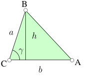
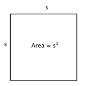
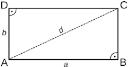
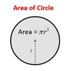
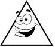
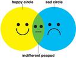

# Calculation over a shape list.

## Rules:
Implement each requirement one by one and in order. Do not procced to the next section without finishing the previous one.   
Please cover with tests the most relevant functionality. 
Time: You will have 45 minutes to implement the first four requirements.

We have a list of shapes and we need to be able to apply calculations on those shapes. 
Those shapes could be triangles and/or Squares. 
The business is not quite sure if we will need to add more shapes, but it has been asked that we should prepare the application to accommodate newer shapes. 

### ONE 
The first calculation that the business has required is to perform summations over the area of the different shapes on the list. So if we have 3 shapes 1 triangle and 2 squares which areas are 3, 4 and 6, the result of the calculation should be 13.
Based on informal conversation the business is not sure about how many calculation types will be performed over the list of shapes. 

| Triangle:       | Square:         |
| --------------- | --------------- |
|  |  |
| Area: (b *h)/2  | Area: s*s       |

### TWO

A new shape has been added rectangle. Everything need to work as it was but in the list of shapes we can have this new shape.

The team lead suggests that maybe a similarity with square.

| Rectangle: |
| ---------- |
|       |
| Area = b *a |

### THREE

The business has an exacting opportunity to catch a client if we add a new functionality to our software.

This client is particularly interested in being able to calculate the sum of all the corners that exists in a list of shapes.

It is our opportunity to prove we can manage it.

It has been mentioned that both of the calculations need to operate over the same list.

### FOUR

| Circle:         |
| --------------- |
|  |
| Note π: 3.1415  |

**EXTRA**: If you finish the previous 4 sections on the time designated, you can continue with this other 2. 

### FIVE

It seems a new requirement has arrived... We need to take now into account the shape mood. It could Normal, Happy or Super happy. 

If the shape is super happy, the area and the corners count triple.

If the shape is happy counts double 

And if it is normal, it counts as previously described. 

The business is really worried about this change, everything needs to work as it was, including the tests, and the team lead seems reluctant to change the shape classes.

 

### SIX 

The business realized the circle mood is not adding for the corner counts feature, and they took a decision:

Super Happy Circle: It counts 10 corners 

Happy circle: It counts count 5 corners.

## [Answers](./Answers.md)

